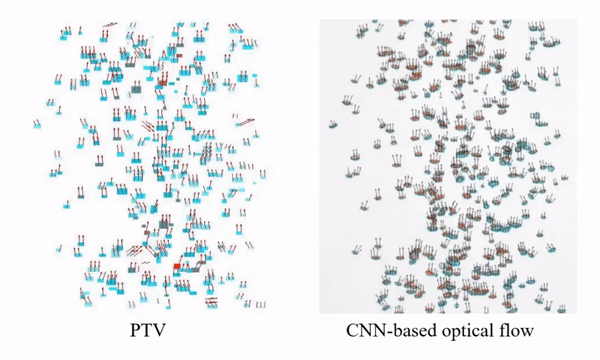
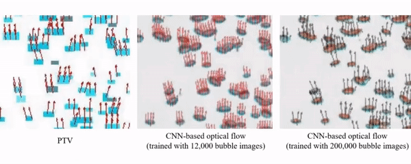
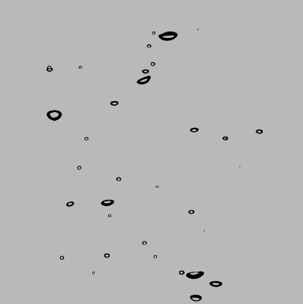
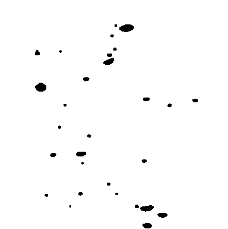
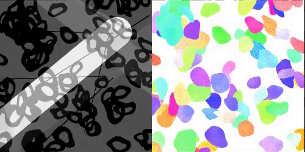

# DeepBubbleVelocimetry for evaluating the bubble velocity field 

This is a project of [Multiphase flow & Flow visualization Lab](https://mffv.snu.ac.kr/). The purpose of the project is to obtain the bubble velocity field from experimental images using CNN-based optical flow model. More information can be found in the paper ([Choi et al. 2022](https://doi.org/10.1038/s41598-022-16145-y)). 

The codes are based on [PWC_Net (Sun et al. 2018)](https://github.com/NVlabs/PWC-Net) with the pre-trained weights. The tensorflow version can be found [here](https://github.com/philferriere/tfoptflow).

The output of the model is as follows:

- velocity field (two dimensional array in techplot format, or it can be read through wordpad or text in Window OS)
- velocity field contour (png)

The repository includes:

- Source code of implementation of PWC-Net based on the finetuned weights.
- Source code to generate the velocity field (techplot file) and its contour (png).

The examples of the result is shown below:
- Application for bubble plume with various void fractions


- Comparison with the PTV and CNN-based optical flow for dense bubble plume


- Effect of the training (it is seen that the horizontal vectors from the weakly trained model are inaccurate)


## Tested environment
This code was tested on the below environment.

- NVIDIA RTX 2080 ti
- Driver 440.95.01
- CUDA 10.2
- cuDNN 7.6.5
- Python 3.7
- TensorFlow 1.14.0
- Keras 2.2.5
(If compatibility issue occurs, please refer to the original PWC-Net [link](https://github.com/philferriere/tfoptflow))


## Preparing the input
Prepare two consecutive bubble images (format of JPG or PNG or TIF) and one mask image.
- For example, Img_0001.png, Img_0002.png, and msk_0001.png 
- (Here, the square size is recommended, e.g., 300 x 300 pixels)






## How to test your own bubble image/video

### Option A: Docker (recommended, no environment setup required)

```bash
# 1. Install Git LFS and clone
git lfs install
git clone https://github.com/dae416/DeepBubbleVelocimetry.git
cd DeepBubbleVelocimetry

# 2. Build Docker image
docker build --platform linux/amd64 -t dbv .

# 3. Run prediction (place your images in SampleImages/ first)
docker run --platform linux/amd64 --rm \
  -v $(pwd):/workspace \
  dbv \
  python -c "
import os, sys
sys.path.insert(0, '/workspace/Code')
os.environ['CUDA_VISIBLE_DEVICES'] = '-1'
# ... or launch Jupyter: jupyter notebook --ip=0.0.0.0 --allow-root
"
```

> **Apple Silicon (M1/M2/M3) users:** Use Rosetta 2 emulation for best compatibility:
> ```bash
> colima start --arch x86_64 --vm-type vz --vz-rosetta
> ```

### Option B: Native environment (GPU recommended)

1. Clone this repository (Git LFS required: `git lfs install` before cloning)
1. Install dependencies (If compatibility issue occurs, please refer to the original PWC-Net link)
1. Run prediction script (`CNN_OpticalFlow.ipynb`) **in `Code/` directory** to obtain the velocity field.

> The trained weights (`DBV_MFFV`) are stored in the `Weights/` folder via Git LFS and will be downloaded automatically when you clone the repository.


## Generating the synthetic bubble images
- Code is attached in the "SyntheticBubbleImage" folder (`BimgGen.ipynb` + `dh_synimagegen9.py`).
- The density, velocity, magnitude of deformation (or the light noise) can be controlled using code.
- Output of the code is as follows: Two consecutive bubble images and one flow file (visualized by color contour below).



Any comments/questions are welcome.
Please contact to dae416@snu.ac.kr
